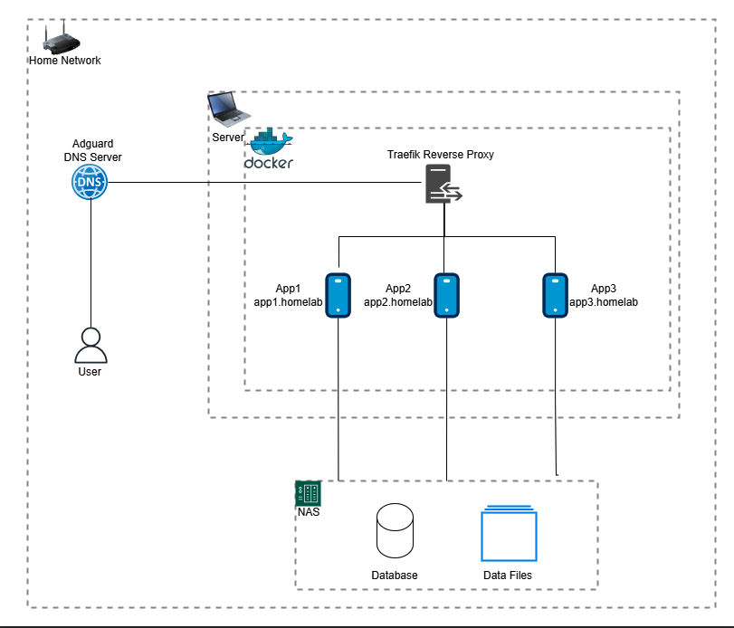

This document outlines the design, setup, and implementation of my selfhosted architecture. The goal is to create a working environment for hosting various applications within a home lab setup.

## Design Architecture

## Setup

### Home Network

The foundation of this architecture is the home network, managed by my home router.

### User Devices

Multiple devices, such as PCs, smartphones, and tablets, are connected to this home network. These devices act as endpoints for interacting with the services hosted within the home lab.

### Adguard DNS Server

An Adguard DNS server is utilized to filter out unwanted ads, enhance privacy and most importantly having our own local custom domains. It functions as a DNS resolver, blocking ads, trackers, and malicious websites, thereby providing a cleaner and safer browsing experience.

### Server with Docker

At the core of the setup is a server running Docker. Docker facilitates the deployment of containerized applications, ensuring that each application runs in an isolated environment. This approach is both resource-efficient and highly flexible.

### Traefik Reverse Proxy

To manage traffic within the Docker environment, a Traefik reverse proxy is deployed. Traefik routes incoming requests to the appropriate Docker container based on domain rules, ensuring organized and accessible services.

### Applications

Several applications are hosted within Docker containers, accessible via subdomains (e.g., app1.homelab, app2.homelab). This modular setup allows for easy management and scalability of individual services.

### Network Attached Storage (NAS)

A Network Attached Storage (NAS) device is integrated to provide centralized storage for all files. This ensures easy access and management of data across various devices and applications.

### Database and Data Files

Database system is used to handle structured data needs of various applications, ensuring data integrity and accessibility.

In addition to structured data, a separate storage solution for unstructured data like media files and documents is implemented. This storage is accessed and managed by the applications as needed. For eg: Data files
